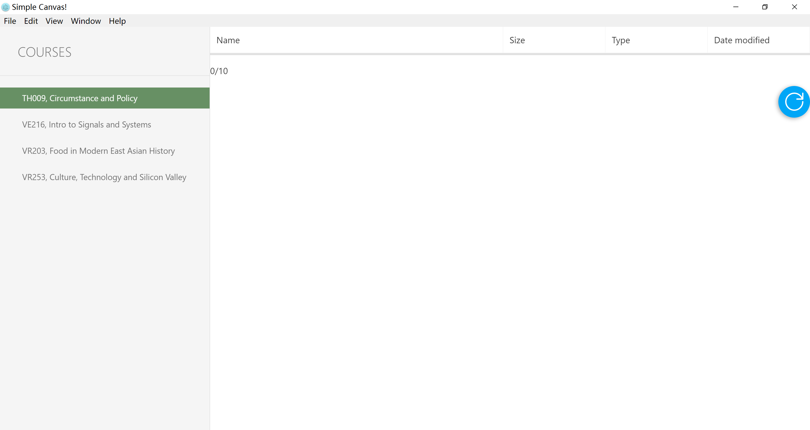

# FastCanvas

A small thing just for automating Canvas

**UPDATE**: we have a frontend now! (a very simple one...)

Looks like this:

## Dependency

* Haskell compiler: (such as GHC)

* Some Haskell libraries; please wait for us to make the backend a *stack* package, so that libraries can be installed automatically.

* Node.js

## Usage

We take GHC for example as the Haskell compiler.

1. After pulling this repo, `ghc Backend/Main.hs -O2 -threaded`, and wait until you get `Backend/Main(.exe)`.

2. Move it to `App`, and `cd App`.

3. Run `npm install`, then `npm start`.

4. Wait for something like the illustration shows.

## Design

The backend will produce two threads at runtime:

1. Observer thread (main thread) forks the working thread,

    feed it a cross-thread channel for passing progress information,

    and enter a loop observing.

2. Working thread is warped in a monad stack, providing *Global Variables*, *Logger*, *Communicating channel*, *Exception handling* and *IO*.

The outcome:

* final result is fedback as the content of webpage.

* progress information (as the operations may take long) are fed to frontend through server-push (thread #1 will do it).

For now, the frontend bind to endpoint `courses`, and display the response under the title.

## TODO

### Backend

* [ ] Add git-like version control system; it can be a much simplified version.

* [ ] Add remapping of files: a list of `filter` rules selecting files, and a list of `remapping` rules to modify and move them.

    For example, I want to move all files satisfying regex "lecture\d\*_ve216_ch\d\*" to "Handout\$2\Lecture$1".

* [ ] Persistent storage of gathered information, including notifications.

### Frontend

* [x] Have a frontend. It could well be Electron, or others.

    We seem to have a frontend now.

* [ ] Provide some style, such as resource and .css files.
